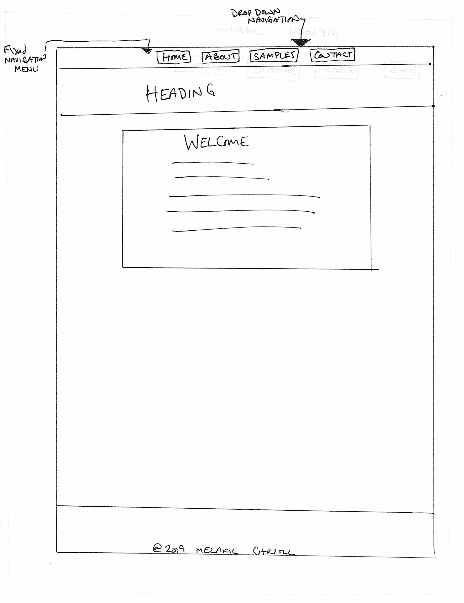
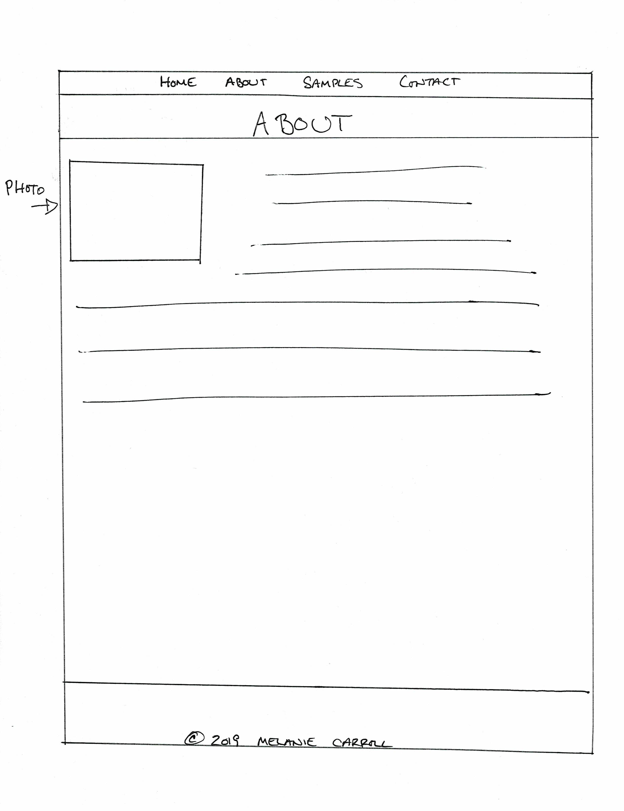
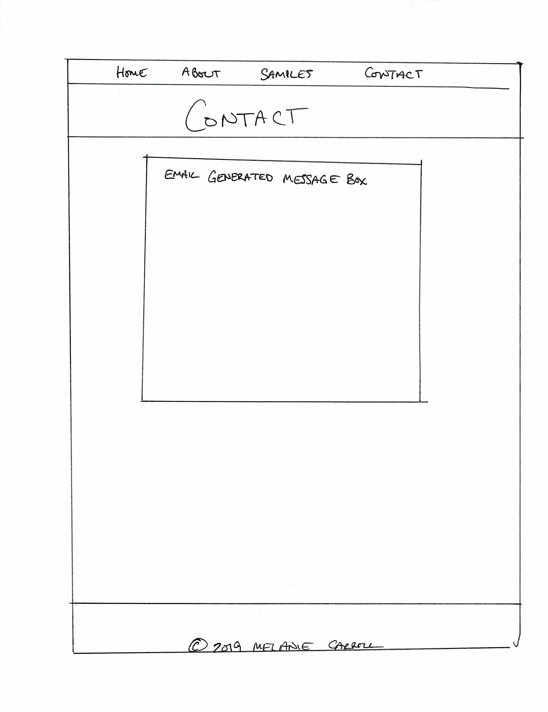

# My INF 7420 Project

I am going to build a portolio site. The main purpose of this project will be to showcase my work and help me find a job before I graduate

## Wireframes

In order to form a more complete vision, here are some wireframes to show how the site architecture layout could be.

Header- will include the navigation menu and name

Navigation menu- will contain links to main pages 

Main Content- will include welcome message

Footer- Will include copyright info

Header- will include the navigation menu and name

Navigation menu- will contain links to main pages

Main Content- will include photo and content regarding author

Footer- will include copyright info

Header- will include the navigation menu and name

Navigation menu- will contain links to main pages

Main Content- will include email generated message box

Footer- will include copyright info